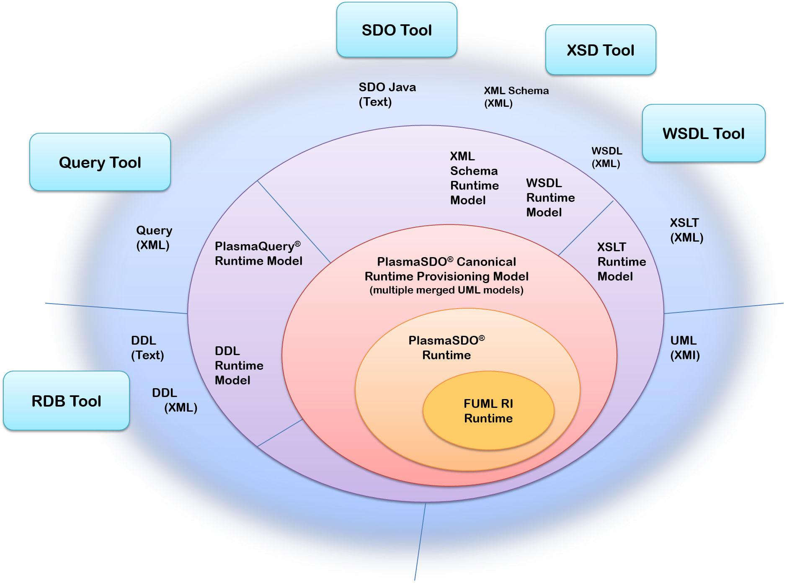
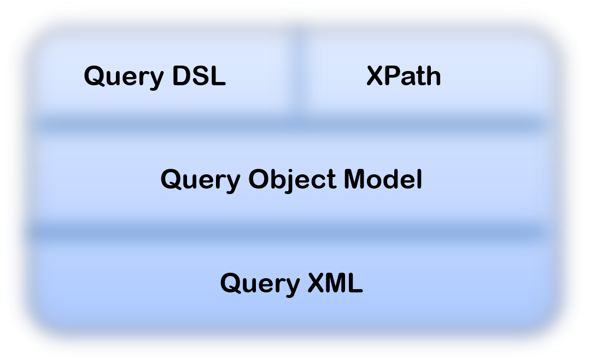
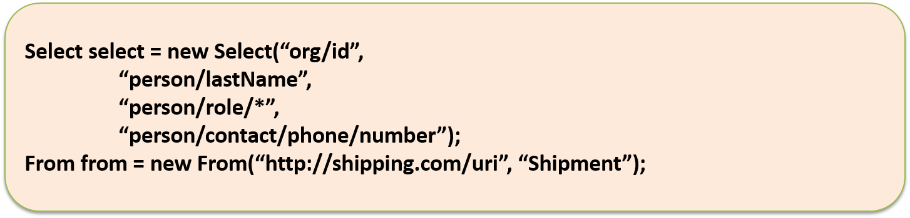

Plasma

Plasma Design Team
TerraMeta Software, Inc.

Architecture Overview

PlasmaSDO® and PlasmaQuery® are registered

Trademarks of TerraMeta Software. All rights reserved.

**Revision History**

|              |                  |                                     |                    |
|--------------|------------------|-------------------------------------|--------------------|
| **Revision** | **Date**         | **Description**                     | **Author**         |
| 1.0          | January 05, 2012 | Plasma SDO architecture description | Plasma Design Team |
| 1.1          | April 12, 2015   | Plasma SDO architecture description | Plasma Design Team |
| 1.2          | January 3 2017   | Various additions                   | Plasma Design Team |

<table>
<tbody>
<tr class="odd">
<td> 
 
 
 
Table of Contents</td>
</tr>
<tr class="even">
<td>
<a href="#_Toc318020900">Architecture Overview i</a>

<a href="#introduction">1 Introduction 4</a>

<a href="#overview"><strong>1.1</strong> <strong>Overview</strong> 4</a>

<a href="#data-graphs">1.1.1 Data Graphs 4</a>

<a href="#change-summaries">1.1.2 Change Summaries 4</a>

<a href="#runtime-available-metadata">1.1.3 Runtime Available Metadata 4</a>

<a href="#persistence-as-a-service">1.1.4 Persistence as a Service 4</a>

<a href="#code-generation">1.1.5 Code Generation 4</a>

<a href="#enterprise-game-changer">1.1.6 Enterprise Game Changer 4</a>

<a href="#mission-statement"><strong>1.2</strong> <strong>Mission Statement</strong> 5</a>

<a href="#history"><strong>1.3</strong> <strong>History</strong> 6</a>

<a href="#project-charter">2 Project Charter 6</a>

<a href="#architecture">3 Architecture 6</a>

<a href="#overview-1"><strong>3.1</strong> <strong>Overview</strong> 6</a>

<a href="#core"><strong>3.2</strong> <strong>Core</strong> 6</a>

<a href="#graph-manipulation">3.2.1 Graph Manipulation 6</a>

<a href="#plasma-sdo-uml-profile"><strong>3.3</strong> <strong>PlasmaSDO™ UML Profile</strong> 6</a>

<a href="#repository"><strong>3.4</strong> <strong>Repository</strong> 6</a>

<a href="#namespaces">3.4.1 Namespaces 7</a>

<a href="#classifiers">3.4.2 Classifiers 7</a>

<a href="#properties">3.4.3 Properties 7</a>

<a href="#enumerations">3.4.4 Enumerations 7</a>

<a href="#provisioning"><strong>3.5</strong> <strong>Provisioning</strong> 7</a>

<a href="#plasma-sdo-runtime-provisioning-model">3.5.1 PlasmaSDO™ Runtime Provisioning Model 8</a>

<a href="#plasma-query-api"><strong>3.6</strong> <strong>PlasmaQuery™ API</strong> 8</a>

<a href="#physical-model-independence">3.6.1 Physical Model Independence 9</a>

<a href="#class-model-independence">3.6.2 Class Model Independence 9</a>

<a href="#persistence-framework-independence">3.6.3 Persistence Framework Independence 9</a>

<a href="#no-free-text-ql-parsing">3.6.4 No Free Text QL Parsing 9</a>

<a href="#projections">3.6.5 Projections 9</a>

<a href="#plasma-query-dsl">3.6.6 PlasmaQuery™ DSL 9</a>

<a href="#plasma-query-dsl-examples">3.6.7 PlasmaQuery™ DSL Examples 10</a>

<a href="#plasma-query-xpath">3.6.8 PlasmaQuery™ XPath 10</a>

<a href="#plasma-query-xpath-examples">3.6.9 PlasmaQuery™ XPath Examples 10</a>

<a href="#query-object-model">3.6.10 Query Object Model 10</a>

<a href="#serialized-query-xml">3.6.11 Serialized Query XML 10</a>

<a href="#serialized-query-xml-examples">3.6.12 Serialized Query XML Examples 11</a>

<a href="#configuration"><strong>3.7</strong> <strong>Configuration</strong> 11</a>

<a href="#sdo-helper"><strong>3.8</strong> <strong>SDO Helper</strong> 11</a>

<a href="#sdo-xpath"><strong>3.9</strong> <strong>SDO XPath</strong> 11</a>

<a href="#sdo-xml"><strong>3.10</strong> <strong>SDO XML</strong> 11</a>

<a href="#data-access-services"><strong>3.11</strong> <strong>Data Access Services</strong> 11</a>
</td>
</tr>
</tbody>
</table>

|                                        |
|----------------------------------------|
| Table of Figures                       |
| **No table of figures entries found.** |

**Introduction**
================

**Overview**
------------

A data store is a generic repository for an integrated set of objects, typically defined within one or more metadata (models) or schemas, which can be requested from numerous different vantage points and returned in numerous structural representations. Such results representations are typically organized as flat tabular structures, and it has long been the role of the application developer to assemble meaningful views of this generic data. Such views can vary in structural complexity, but as application sophistication increases given even a simple data model, such results likewise increase in complexity approaching hierarchical, network or often even graph structures.

### Data Graphs

Graph or directed-graph structures are difficult to process because of potential cycles and other conditions, and are at the same time extremely common. An architectural strategy which places the burden of assembling, retrieving, copying, inserting and deleting data graphs in an ad-hoc fashion onto application developers is not typically effective, and often results in thousands or even tens-of-thousands of lines of unnecessary application code.

The Service Data Objects (SDO) 2.1 specification supports graph structures or “Data Graphs” as a fundamental structural unit, allowing application developers to describe and manipulate the graph structures as a whole, unconcerned with the underlying mechanics of assembly, traversal or other complex operations on a graph.

### Change Summaries

Under SDO, changes made to a Data Graph are automatically collected in a Change Summary. A Change Summary is a structure which accompanies the graph and stores information about the type of operation (e.g. created, modified, deleted), the target of the operation, and the path through the graph to the target. Change summary structures can be serialized and are not dependent on any particular persistence framework or data store.

### Runtime Available Metadata

The Service Data Objects (SDO) 2.1 specification provides an extensible, lightweight runtime-available structural metadata API.

### Persistence as a Service

Allied with fine grained control of its Data Graph structure and the ability to detect and propagate changes to any Data Graph, the Service Data Objects (SDO) 2.1 specification and accompanying whitepapers outline a vision for generic persistence, or persistence-as-a-service. A persistence service or Data Access Service (DAS) under SDO abstracts away the complexity of assembling and dispatching any arbitrary Data Graph regardless of depth or complexity from a data store. Changes to a graph are likewise dispatched back to the data store, the DAS handling all data-store specific functions including transaction management, concurrency and other operations depending on its sophistication and the nature of the underlying data store.

### Code Generation

The Service Data Objects (SDO) 2.1 specification contains various requirements and guidelines for the automatic generation of SDO data access and related source code from models. Depending on the size of a model or set of models, the cost savings in comparison to hand-coding is typically quite substantial. Unfortunately still today under various persistence frameworks and associated architecture strategies, this activity is still often the bane of the application developer.

### Enterprise Game Changer

First published in 2006, the SDO 1.2 specification has fostered several implementations, some of which are in use by all major application server vendors and numerous other commercial products. As a custom application development framework for the typical enterprise web application however, adoption has been less widespread. Nevertheless, each major specification component under SDO 1.) Control over arbitrary graph structures 2.) Graph change-summaries, 3.) Runtime-available metadata, 4.) Black-box persistence and 5.) Code generation, taken together and applied to a typical enterprise web software project, constitute a radical improvement from what is often typically found in both the commercial and government sectors.

Using a real production example of an enterprise Java™ web application from an unnamed government agency involving the processing of equipment and service solicitations from various commercial providers, we find the following standard software layers and associated lines-of-code.

Table - Example Enterprise Java™ Project Software Layers

| Software Layer               | Lines of Java™ Code | Lines of XML |
|------------------------------|---------------------|--------------|
| GWT Web Layer                | 55,100              | 1310         |
| **Web Subtotal**             | **55,100**          | **1310**     |
| Stateless Session Facades    | 8,600               | 50           |
| Client Data Transfer (DTO)   | 13,800              | 58           |
| Mid Tier Data Transfer (DTO) | 46,000              | 60           |
| Mid Tier Data Access (DAO)   | 18,500              | 4340         |
| **Data Access Subtotal**     | **86,400**          | **4468**     |
| **Grand Total**              | **141,200**         | **5778**     |

.

From the above table, the source code and XML dedicated primarily to data access is nearly 2/3 of the total 141 thousand lines. If only a fraction of this data access code and XML could have been generated or eliminated, it would have resulted in significant savings at several development lifecycle stages. The various major components of SDO are applicable at each of these standard layers. For instance the mid-tier data transfer (DTO) layer comprising some 46,000 lines of Java code, involves primarily the ad-hoc structural assembly of business-specific data views consisting of data hierarchies and graphs. Replacing just these 46,000 lines of “one-off” structural assembly code alone with an SDO RDBMS Data Access Service (DAS), results in a savings of nearly 1/3 of the total 141,200 Java lines. In fact as seen below, each of the above dedicated data-access layers are either 1.) Partially or entirely replaceable or 2.) Automated through code generation under an enterprise software strategy centered on SDO.

-   **Stateless Session Facades** – use generated (Java) SDO classes to compose complex structures and SDO Data Access Service(s) for any structural assembly

-   **Client Data Transfer (DTO)** - use generated (Java) SDO classes

-   **Mid Tier Data Transfer (DTO)** - use generated (Java) SDO classes to compose complex structures and SDO Data Access Service(s) for any structural assembly

-   **Mid Tier Data Access (DAO)** - use generated (Java) SDO classes and SDO Data Access Service(s)

**Mission Statement**
---------------------

In its initial releases, the PlasmaSDO® implementation seeks to address the need for metadata-driven automation and code generation under SDO for standard enterprise Java web applications while focusing on critical operational considerations these applications face, such as optimistic and pessimistic concurrency control. The PlasmaSDO® implementation is not bound to any integrated development environment (IDE) and provides support for standard Java™ based build tools. *Note: Such operational considerations such as optimistic and pessimistic concurrency control are seen as a feature gap within various commercial and open-source SDO offerings, and are facilitated in PlasmaSDO*® *by a custom UML profile and various associated SDO API extensions.*

**History**
-----------

The major concepts giving rise to the PlasmaSDO® design evolved out of a medium-scale (10,000 concurrent, 1 million total users) web application for management of personal property shipping. This application was developed starting in 2004 for a large government agency and involved more than 1 million lines of generated data access related code. It is in successful production today, and though it pre-dates the advent of SDO in 2006, involves several of the core SDO concepts including 1.) Runtime-available metadata 2.) Directed graph structures as a fundamental processing unit, 3.) Change summaries and 4.) Generic service-oriented persistence. The PlasmaSDO® implementation pays homage to this history through various shipment or shipping model related examples.

**Project Charter**
===================

**Architecture**
================

**Overview**
------------

**Core**
--------

At its core, the PlasmaSDO® implementation contains a directed graph or digraph model and a set of metadata driven graph traversal algorithms. Data Objects under PlasmaSDO® form a digraph transparently as a client manipulates the SDO API, graph edges or links being automatically created and used internally to manage associations between Data Object nodes.

### Graph Manipulation

Clients can assemble a Data Graph ad-hoc or query for a graph. Several API implementing the Visitor pattern[1] are then available to facilitate custom traversal operations on a graph.

**Plasma SDO UML Profile**
--------------------------

The Service Data Objects (SDO) 2.1 specification provides an extensible, lightweight runtime-available metadata API. It is through extensions to the SDO metadata API that the PlasmaSDO® implementation provides more than just standard structural metadata elements, but numerous other context specific elements instructive at build-time as well as run-time to SDO Data Access Services and other consumers at various enterprise technology layers and various parts of a technology stack.

The PlasmaSDO® metadata extensions are described in a UML profile which contains UML stereotypes, enumerations and other elements used to enrich UML models for use within the PlasmaSDO® core as well as third party Data Access Service (DAS) providers. Particular design consideration has been focused on leaving each stereotype granular with only a few tightly related attributes/tags, rather than more monolithic stereotype groupings. This approach lets each stereotype convey far more meaning and maps well to metadata oriented extensions in various target languages, such as Java™ annotations. This granular approach can however have the effect of making UML diagrams more cluttered depending on the presentation settings of the UML diagramming tool.

A single UML logical model fully enriched or annotated with the PlasmaSDO® UML profile provides enough context specific information to support various technology-specific runtime environments and the generation of numerous context or platform-specific models as well as many other related source-code and other artifacts. **\[add link reference\]**

**Repository**
--------------

The Service Data Objects (SDO) 2.1 specification provides an extensible, lightweight runtime-available metadata API, and the SDO metadata API implementation under PlasmaSDO® is supported by an in-memory UML repository. Application UML model artifacts in XMI format[2] annotated with the **PlasmaSDO**® **UML Profile** are loaded at runtime and merged using the [**Foundational UML (FUML)**](http://portal.modeldriven.org/project/foundationalUML) reference implementation distributed by **[modeldriven.org](http://modeldriven.org)*. *** An intermediate repository layer provides cached association and generalization relation-path information spanning multiple classifiers or models useful for Data Access Services. In addition it provides convenient access to basic UML elements and associated stereotype instances. In general, the SDO metadata API (e.g. Type, Property and TypeHelper), implementation delegates to the intermediate repository layer, which then delegates to the [**FUML**](http://portal.modeldriven.org/project/foundationalUML) repository. Though multiple UML models may be loaded, SDO metadata is created only on demand as accessed.

Figure – Repository Layers

### Namespaces

### Classifiers

### Properties

### Enumerations

The PlasmaSDO™ implementation provides “end-to-end” support for UML enumerations. Enumerations and enumeration literals, including physical name aliases and other stereotypes, are taken from UML definitions through not only to generated SDO and other source code, but also more data-store specific artifacts, such as DDL check constraints.

**Provisioning **
-----------------

The code generation or provisioning under PlasmaSDO® brings together several important architecture components for use at both build-time as well as run-time. The build-time provisioning tools are compatible-with but not dependent upon any Integrated Development Environment (IDE), but are rather are geared for larger scale enterprise projects needing support for [**Ant**](http://ant.apache.org/), [**Maven**](http://maven.apache.org/) and continuous integration build environments such as [**Hudson**](http://hudson-ci.org). Build files typically access a set of command-line provisioning tools using [**Ant**](http://ant.apache.org/) tasks triggering a variety of operations. In general, application UML model artifacts in XMI format[3] annotated with the **PlasmaSDO**® **UML Profile** are first loaded and merged using the [**FUML**](http://portal.modeldriven.org/project/foundationalUML) runtime, then projected as a whole or in part onto an intermediate provisioning model, typically in-memory. The provisioning model is then merged with configuration information and transformed into one of several available target outputs, comprised of source code or models specific to a particular context or technology platform. Where a particular technology target is not provided, the intermediate provisioning model can be marshaled as XML, custom transformations using XSLT for instance converting the provisioning XML document into almost any target format.

Figure - PlasmaSDO® Provisioning API

### Plasma SDO Runtime Provisioning Model

The PlasmaSDO® provisioning model is an intermediate staging or marshaling model which represents a simplified and “merged" view of any number of linked XMI/UML documents as XML. It accommodates basic UML structural and behavioral elements along with profile stereotype elements from the **PlasmaSDO**® **UML Profile**. The goal is to provide an XML representation that more readily supports the use of “templating” languages such as XSLT. It resolves common problems associated with the XML representation of stereotyped UML models, such as representation of graph structures and linkage of stereotype instances to respective targets. Representation of graph structures is accommodated using reference or "ref" elements which are namespace qualified. And as a convenience, profile stereotypes are represented as child "delegate" objects directly under the target element being annotated, rather than placing the burden on processors to locate stereotypes at the root (XMI) level and link them.

**Plasma Query API**
--------------------

The PlasmaQuery® API provides a flexible mechanism to fully describe any arbitrary SDO results Data Graph, independent of any persistence framework or type of data store. PlasmaQuery™ supports XPath expressions as a free-text “surface language”, parsed by the API implementation and used to construct an underlying query object model representation. As an alternative to free-text, PlasmaQuery™ contains a query Domain Specific Language (DSL) generator and API facilitating (IDE) code-completion, 100% compile-time checking and resulting in code with an almost “fluent” English appearance based on your business model. At runtime the PlasmaQuery™ DSL implementation constructs an underlying query object model representation. The detailed query object model can also be manipulated directly and consists of various criteria entities such as expressions, properties, operators, parameters, etc… as well as convenient factory operations which allow precise user and system control over the various elements constituting a query. The object model can also be serialized as XML for wire transport, persistence, flat file or other usage. The below diagram illustrates the layering and various query representations supported under the PlasmaQuery™ API.

Figure - PlasmaQuery™ API

### Physical Model Independence

The PlasmaQuery® API uses logical model names for types, properties and other elements within a UML model and is not dependent on any physical data store or physical data store model names, such as RDBMS table or column names. This approach provides independence and isolation from name changes in physical data stores. *Note:* *the use of physical data store and compiled class names is however supported under PlasmaQuery*®*, as specified and in keeping with the SDO 2.1 alias API.*

### Class Model Independence

The PlasmaQuery® API uses logical model names for types, properties and other elements within a UML model and is not dependent on compiled Java class model names such as Java class, field or method names. This approach provides independence and isolation from name changes in generated or hand coded java class models used for SDO persistence. *Note:* *the use of physical data store and compiled class names is however supported under PlasmaQuery™, as specified and in keeping with the SDO 2.1 alias API.*

### Persistence Framework Independence

Unlike various other query models, PlasmaQuery™ is not bound to any specific persistence framework or associated specific style or category of data store. It can therefore model federated queries across any number of Data Access Services (DAS) supporting a variety of possible data stores.

### No Free Text QL Parsing

Eliminating the need for free-text query language parsing, Data Access Service (DAS) providers under PlasmaSDO™ simply interpret the PlasmaQuery™ object model, and depending on the nature of the DAS and the needs of the underlying data store, either manipulate data store specific API directly, such as JDBC, or dynamically generate data store specific intermediate query language text (e.g. SQL, JPAQL, or JDOQL) and assemble a Data Graph.

### Projections

PlasmaQuery™ serves as a mechanism to project from static SDO models to dynamic SDO models. A typical physical data model may consist of hundreds or even thousands of entities. A projection using PlasmaQuery™ projects from a primary, static model into a new dynamic model comprised of only the limited types and properties specified in the query. The new dynamic (logical) model still operates on the same underlying physical model. In addition to constraining the projected types and properties, a PlasmaQuery™ may project new name aliases or other attributes onto the projection model elements. Some of these are read-only, visibility, containment and other related attributes.

### Plasma Query DSL

As an alternative to free-text, PlasmaQuery® contains a query Domain Specific Language (DSL) generator and API facilitating (IDE) code-completion, 100% compile-time checking and resulting in code with an almost “fluent” English appearance based on your business model(s). At runtime the PlasmaQuery® DSL implementation builds the underlying query object model representation.

### Plasma Query DSL Examples

The below Java™ language example shows a query using generated DSL class ‘QShipment’ which describes a results data graph linking shipments, persons, contacts and other information. The query contains a simple wildcard “where” predicate.

### Plasma Query XPath 

XPath can be thought of as the free-text “surface language” for PlasmaQuery™ which in its simplest form consists of a collection of XPath expressions.

### Plasma Query XPath Examples

The below example query returns ‘Shipment’ Data Graphs, the graph including organization, person-role and person-contact information nodes. *Note: the ‘@’ character designating attributes/properties is optional but supported as per the SDO 2.1 Specification.*

Each step or node within an XPath expression can contain predicates. Predicates are be used by Data Access Services to limit not only results from the extent or root, but to limit collections within a result Data Graph for any collection or “many” property along a path. An XPath predicate is contained within square brackets \[\], and comes after the parent object of what will be tested. The below example describes a data graph consisting of shipments linked to organization “Ten Speed Press” with all person roles and only person home contact information.

### Query Object Model

The detailed query object model can be manipulated directly and consists of various criteria entities such as expressions, properties, operators, parameters, etc… It contains convenient factory operations which allow precise user and system control over the various elements constituting a query.

### Serialized Query XML

The query object model has an associated XML Schema representation and can be serialized as XML using standard JAXB based marshaling for wire transport, persistence, flat file or other usage.

### Serialized Query XML Examples

**Configuration**
-----------------

**SDO Helper**
--------------

**SDO XPath**
-------------

**SDO XML**
-----------

**Data Access Services**
------------------------

[1] http://www.oodesign.com/visitor-pattern.html

[2] http://en.wikipedia.org/wiki/XML\_Metadata\_Interchange

[3] http://en.wikipedia.org/wiki/XML\_Metadata\_Interchange
