**Plasma UML Profile**
==================================================================================================

**TerraMeta Software, Inc.**

PlasmaSDO® and PlasmaQuery® are registered

Trademarks of TerraMeta Software

**Revision History**

|              |                   |                 |                     |
|--------------|-------------------|-----------------|---------------------|
| **Revision** | **Date**          | **Description** | **Author**          |
| 1.1.7        | November 26, 2011 |                 | Plasma Team Members |

<table>
<tbody>
<tr class="odd">
<td> 
 
 
 
Table of Contents</td>
</tr>
<tr class="even">
<td>
<a href="#introduction">1 Introduction 1</a>

<a href="#_Toc310065925"><strong>1.1</strong> <strong>Purpose</strong> 1</a>

<a href="#_Toc310065926"><strong>1.2</strong> <strong>Scope</strong> 1</a>

<a href="#overview"><strong>1.3</strong> <strong>Overview</strong> 1</a>

<a href="#package-plasma-sdo-profile">2 Package Plasma SDO Profile 2</a>

<a href="#stereotype-sdoalias"><strong>2.1</strong> <strong>Stereotype SDOAlias</strong> 4</a>

<a href="#attribute-detail"><strong>2.1.1</strong> <strong>Attribute Detail</strong> 5</a>

<a href="#relation-detail"><strong>2.1.2</strong> <strong>Relation Detail</strong> 5</a>

<a href="#stereotype-sdoconcurrent"><strong>2.2</strong> <strong>Stereotype SDOConcurrent</strong> 6</a>

<a href="#attribute-detail-1"><strong>2.2.1</strong> <strong>Attribute Detail</strong> 6</a>

<a href="#relation-detail-1"><strong>2.2.2</strong> <strong>Relation Detail</strong> 7</a>

<a href="#stereotype-sdoderivation"><strong>2.3</strong> <strong>Stereotype SDODerivation</strong> 7</a>

<a href="#attribute-detail-2"><strong>2.3.1</strong> <strong>Attribute Detail</strong> 7</a>

<a href="#relation-detail-2"><strong>2.3.2</strong> <strong>Relation Detail</strong> 7</a>

<a href="#stereotype-sdodocumentation"><strong>2.4</strong> <strong>Stereotype SDODocumentation</strong> 8</a>

<a href="#attribute-detail-3"><strong>2.4.1</strong> <strong>Attribute Detail</strong> 8</a>

<a href="#relation-detail-3"><strong>2.4.2</strong> <strong>Relation Detail</strong> 8</a>

<a href="#stereotype-sdoenumeration"><strong>2.5</strong> <strong>Stereotype SDOEnumeration</strong> 9</a>

<a href="#attribute-detail-4"><strong>2.5.1</strong> <strong>Attribute Detail</strong> 9</a>

<a href="#relation-detail-4"><strong>2.5.2</strong> <strong>Relation Detail</strong> 9</a>

<a href="#stereotype-sdoenumerationconstraint"><strong>2.6</strong> <strong>Stereotype SDOEnumerationConstraint</strong> 9</a>

<a href="#attribute-detail-5"><strong>2.6.1</strong> <strong>Attribute Detail</strong> 10</a>

<a href="#relation-detail-5"><strong>2.6.2</strong> <strong>Relation Detail</strong> 10</a>

<a href="#stereotype-sdokey"><strong>2.7</strong> <strong>Stereotype SDOKey</strong> 10</a>

<a href="#attribute-detail-6"><strong>2.7.1</strong> <strong>Attribute Detail</strong> 11</a>

<a href="#relation-detail-6"><strong>2.7.2</strong> <strong>Relation Detail</strong> 11</a>

<a href="#stereotype-sdonamespace"><strong>2.8</strong> <strong>Stereotype SDONamespace</strong> 11</a>

<a href="#attribute-detail-7"><strong>2.8.1</strong> <strong>Attribute Detail</strong> 12</a>

<a href="#relation-detail-7"><strong>2.8.2</strong> <strong>Relation Detail</strong> 12</a>

<a href="#stereotype-sdosemanticconstraint"><strong>2.9</strong> <strong>Stereotype SDOSemanticConstraint</strong> 12</a>

<a href="#attribute-detail-8"><strong>2.9.1</strong> <strong>Attribute Detail</strong> 13</a>

<a href="#relation-detail-8"><strong>2.9.2</strong> <strong>Relation Detail</strong> 13</a>

<a href="#stereotype-sdotemporal"><strong>2.10</strong> <strong>Stereotype SDOTemporal</strong> 13</a>

<a href="#attribute-detail-9"><strong>2.10.1</strong> <strong>Attribute Detail</strong> 14</a>

<a href="#relation-detail-9"><strong>2.10.2</strong> <strong>Relation Detail</strong> 14</a>

<a href="#stereotype-sdouniqueconstraint"><strong>2.11</strong> <strong>Stereotype SDOUniqueConstraint</strong> 14</a>

<a href="#attribute-detail-10"><strong>2.11.1</strong> <strong>Attribute Detail</strong> 14</a>

<a href="#relation-detail-10"><strong>2.11.2</strong> <strong>Relation Detail</strong> 15</a>

<a href="#stereotype-sdovalueconstraint"><strong>2.12</strong> <strong>Stereotype SDOValueConstraint</strong> 15</a>

<a href="#attribute-detail-11"><strong>2.12.1</strong> <strong>Attribute Detail</strong> 15</a>

<a href="#relation-detail-11"><strong>2.12.2</strong> <strong>Relation Detail</strong> 16</a>

<a href="#stereotype-sdovaluesetconstraint"><strong>2.13</strong> <strong>Stereotype SDOValueSetConstraint</strong> 16</a>

<a href="#attribute-detail-12"><strong>2.13.1</strong> <strong>Attribute Detail</strong> 17</a>

<a href="#relation-detail-12"><strong>2.13.2</strong> <strong>Relation Detail</strong> 18</a>

<a href="#enumeration-codingstrength"><strong>2.14</strong> <strong>Enumeration CodingStrength</strong> 18</a>

<a href="#literal-detail"><strong>2.14.1</strong> <strong>Literal Detail</strong> 18</a>

<a href="#enumeration-concurentdataflavor"><strong>2.15</strong> <strong>Enumeration ConcurentDataFlavor</strong> 19</a>

<a href="#literal-detail-1"><strong>2.15.1</strong> <strong>Literal Detail</strong> 19</a>

<a href="#enumeration-concurrencytype"><strong>2.16</strong> <strong>Enumeration ConcurrencyType</strong> 19</a>

<a href="#literal-detail-2"><strong>2.16.1</strong> <strong>Literal Detail</strong> 19</a>

<a href="#enumeration-documentationtype"><strong>2.17</strong> <strong>Enumeration DocumentationType</strong> 20</a>

<a href="#literal-detail-3"><strong>2.17.1</strong> <strong>Literal Detail</strong> 20</a>

<a href="#enumeration-keytype"><strong>2.18</strong> <strong>Enumeration KeyType</strong> 21</a>

<a href="#literal-detail-4"><strong>2.18.1</strong> <strong>Literal Detail</strong> 21</a>

<a href="#enumeration-temporalstate"><strong>2.19</strong> <strong>Enumeration TemporalState</strong> 22</a>

<a href="#literal-detail-5"><strong>2.19.1</strong> <strong>Literal Detail</strong> 22</a>

<a href="#enumeration-temporaltype"><strong>2.20</strong> <strong>Enumeration TemporalType</strong> 22</a>

<a href="#literal-detail-6"><strong>2.20.1</strong> <strong>Literal Detail</strong> 22</a>

<a href="#package-plasma-sdo-profiledatatypes">3 Package Plasma SDO Profile::datatypes 23</a>

<a href="#datatype-boolean"><strong>3.1</strong> <strong>Datatype Boolean</strong> 23</a>

<a href="#datatype-byte"><strong>3.2</strong> <strong>Datatype Byte</strong> 24</a>

<a href="#datatype-bytes"><strong>3.3</strong> <strong>Datatype Bytes</strong> 24</a>

<a href="#datatype-character"><strong>3.4</strong> <strong>Datatype Character</strong> 24</a>

<a href="#datatype-date"><strong>3.5</strong> <strong>Datatype Date</strong> 24</a>

<a href="#datatype-datetime"><strong>3.6</strong> <strong>Datatype DateTime</strong> 24</a>

<a href="#datatype-day"><strong>3.7</strong> <strong>Datatype Day</strong> 25</a>

<a href="#datatype-decimal"><strong>3.8</strong> <strong>Datatype Decimal</strong> 25</a>

<a href="#datatype-double"><strong>3.9</strong> <strong>Datatype Double</strong> 25</a>

<a href="#datatype-duration"><strong>3.10</strong> <strong>Datatype Duration</strong> 25</a>

<a href="#datatype-float"><strong>3.11</strong> <strong>Datatype Float</strong> 25</a>

<a href="#datatype-int"><strong>3.12</strong> <strong>Datatype Int</strong> 26</a>

<a href="#datatype-integer"><strong>3.13</strong> <strong>Datatype Integer</strong> 26</a>

<a href="#datatype-long"><strong>3.14</strong> <strong>Datatype Long</strong> 26</a>

<a href="#datatype-month"><strong>3.15</strong> <strong>Datatype Month</strong> 26</a>

<a href="#datatype-monthday"><strong>3.16</strong> <strong>Datatype MonthDay</strong> 26</a>

<a href="#datatype-object"><strong>3.17</strong> <strong>Datatype Object</strong> 27</a>

<a href="#datatype-short"><strong>3.18</strong> <strong>Datatype Short</strong> 27</a>

<a href="#datatype-string"><strong>3.19</strong> <strong>Datatype String</strong> 27</a>

<a href="#datatype-strings"><strong>3.20</strong> <strong>Datatype Strings</strong> 27</a>

<a href="#datatype-time"><strong>3.21</strong> <strong>Datatype Time</strong> 27</a>

<a href="#datatype-uri"><strong>3.22</strong> <strong>Datatype URI</strong> 28</a>

<a href="#datatype-year"><strong>3.23</strong> <strong>Datatype Year</strong> 28</a>

<a href="#datatype-yearmonth"><strong>3.24</strong> <strong>Datatype YearMonth</strong> 28</a>

<a href="#datatype-yearmonthday"><strong>3.25</strong> <strong>Datatype YearMonthDay</strong> 28</a>

<a href="#appendix-a.-diagram">4 Appendix A. Diagram 29</a>

<a href="#uml-comment-extension-stereotypes"><strong>4.1</strong> <strong>UML Comment Extension Stereotypes</strong> 29</a>

<a href="#uml-enumeration-extension-stereotypes"><strong>4.2</strong> <strong>UML Enumeration Extension Stereotypes</strong> 29</a>

<a href="#uml-namedelement-extension-stereotypes"><strong>4.3</strong> <strong>UML NamedElement Extension Stereotypes</strong> 29</a>

<a href="#uml-package-extension-stereotypes"><strong>4.4</strong> <strong>UML Package Extension Stereotypes</strong> 30</a>

<a href="#uml-property-extension-stereotypes"><strong>4.5</strong> <strong>UML Property Extension Stereotypes</strong> 30</a>
</td>
</tr>
</tbody>
</table>

|                                                                              |
|------------------------------------------------------------------------------|
| Table of Figures                                                             |
| [Figure 1. UML Enumeration Extension Stereotypes Diagram 2](#_Toc310066014)  
                                                                               
 [Figure 2. UML Property Extension Stereotypes Diagram 3](#_Toc310066015)      
                                                                               
 [Figure 3. UML Comment Extension Stereotypes Diagram 3](#_Toc310066016)       
                                                                               
 [Figure 4. UML Package Extension Stereotypes Diagram 4](#_Toc310066017)       
                                                                               
 [Figure 5. UML NamedElement Extension Stereotypes Diagram 4](#_Toc310066018)  
                                                                               
 [Figure 6. SDOAlias 5](#_Toc310066019)                                        
                                                                               
 [Figure 7. SDOConcurrent 6](#_Toc310066020)                                   
                                                                               
 [Figure 8. SDODerivation 7](#_Toc310066021)                                   
                                                                               
 [Figure 9. SDODocumentation 8](#_Toc310066022)                                
                                                                               
 [Figure 10. SDOEnumeration 9](#_Toc310066023)                                 
                                                                               
 [Figure 11. SDOEnumerationConstraint 10](#_Toc310066024)                      
                                                                               
 [Figure 12. SDOKey 11](#_Toc310066025)                                        
                                                                               
 [Figure 13. SDONamespace 11](#_Toc310066026)                                  
                                                                               
 [Figure 14. SDOSemanticConstraint 12](#_Toc310066027)                         
                                                                               
 [Figure 15. SDOTemporal 13](#_Toc310066028)                                   
                                                                               
 [Figure 16. SDOUniqueConstraint 14](#_Toc310066029)                           
                                                                               
 [Figure 17. SDOValueConstraint 15](#_Toc310066030)                            
                                                                               
 [Figure 18. SDOValueSetConstraint 17](#_Toc310066031)                         
                                                                               
 [Figure 19. DocumentationType 20](#_Toc310066032)                             
                                                                               
 [Figure 20. UML Comment Extension Stereotypes 29](#_Toc310066033)             
                                                                               
 [Figure 21. UML Enumeration Extension Stereotypes 29](#_Toc310066034)         
                                                                               
 [Figure 22. UML NamedElement Extension Stereotypes 30](#_Toc310066035)        
                                                                               
 [Figure 23. UML Package Extension Stereotypes 30](#_Toc310066036)             
                                                                               
 [Figure 24. UML Property Extension Stereotypes 31](#_Toc310066037)            |

**Introduction**
================

**Overview**
------------

The Service Data Objects (SDO) 2.1 specification provides an extensible, lightweight runtime-available metadata API. It is through extensions to the SDO metadata API that the PlasmaSDO™ implementation provides more than just standard structural metadata elements, but numerous other context specific elements instructive at build-time as well as run-time to SDO Data Access Services and other consumers at various enterprise technology layers and various parts of a technology stack. The PlasmaSDO™ metadata extensions are described this UML profile which contains UML stereotypes, enumerations and other elements used to enrich UML models for use within the PlasmaSDO™ core as well as third party Data Access Service (DAS) providers.

Particular design consideration has been focused on leaving each stereotype granular with only a few tightly related attributes/tags, rather than more monolithic stereotype groupings. This approach lets each stereotype convey far more meaning and maps well to metadata oriented extensions in various target languages, such as Java™ annotations. This granular approach can however have the effect of making UML diagrams more cluttered depending on the presentation settings of the UML diagramming tool.

**Package Plasma SDO Profile**
==============================

**Description**

The PlasmaSDO™ Platform UML profile contains stereotypes used to enrich UML models for use within the PlasmaSDO™ Service Data Objects 2.1 implementation and associated platform. Particular design consideration has been focused towards leaving each stereotype granular with only a few tightly related attributes/tags. This approach lets each stereotype convey far more meaning, but can have the effect of making UML diagrams more cluttered depending on the presentation settings of the UML diagramming tool.
A single UML logical model enriched or annotated with this UML profile provides enough context specific information to support various technology-specific runtime environments and the generation of numerous context or platform-specific models as well as many other related source-code and other artifacts. The Service Data Objects 2.1 specification provides an extensible, lightweight runtime-available metadata API. It is through the SDO metadata API that the PlasmaSDO™ implementation provides more than just standard structural metadata elements, but for models annotated with this UML profile, provides numerous other context specific metadata elements instructive at build-time as well as run-time to various enterprise technology layers and various parts of the platform technology stack.

> 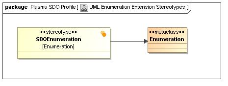

1.  UML Enumeration Extension Stereotypes Diagram

> 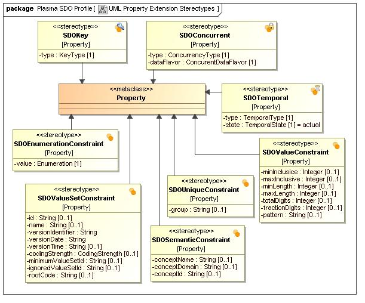

1.  UML Property Extension Stereotypes Diagram

> 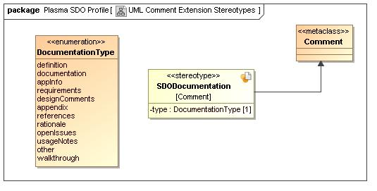

1.  UML Comment Extension Stereotypes Diagram

> 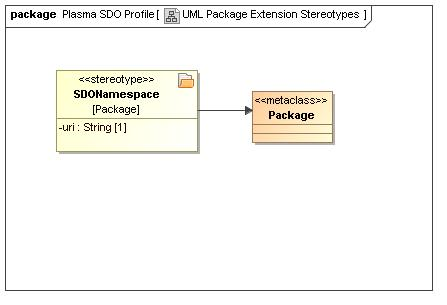

1.  UML Package Extension Stereotypes Diagram

> 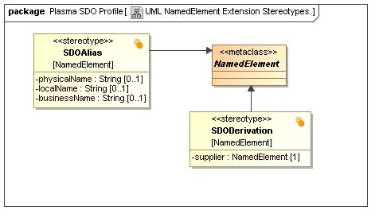

1.  UML NamedElement Extension Stereotypes Diagram

Table 1 - Plasma SDO Profile Package Detail

|                    |                    |
|--------------------|--------------------|
| **Name**           | Plasma SDO Profile |
| **Qualified Name** | Plasma SDO Profile |

**Stereotype** **SDOAlias**
---------------------------

**Description**

This stereotype provides modelling-context specific alternative names for UML named elements within a model. While a UML logical model often differs greatly from a physical model for example, the intent is to provide enough naming and other context specific information to make the physical model entirely reflective or derivitive of the UML logical model. In other words support the generation of multiple context-specific models from a single UML logical model. Modelling context specific names or aliases are particularly important as they often differ greatly between modelling contexts due to various standard naming conventions or technology limitations such as name length.

> 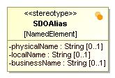

1.  SDOAlias

Table 2 - SDOAlias Stereotype Detail

|                      |                                                                     |
|----------------------|---------------------------------------------------------------------|
| **Name**             | SDOAlias                                                            |
| **Qualified Name**   | Plasma SDO Profile::SDOAlias                                        |
| **Visibility**       | public                                                              |
| **Abstract**         | false                                                               |
| **Base Stereotypes** |                                                                     |
| **Metaclass**        | UML Standard Profile::UML2 Metamodel::Classes::Kernel::NamedElement |

### **Attribute Detail**

Following are the attributes for stereotype, SDOAlias.

Table 3 – SDOAlias Attribute Detail

|                  |                                                                                                                                                                                                                                            |        |             |            |
|------------------|--------------------------------------------------------------------------------------------------------------------------------------------------------------------------------------------------------------------------------------------|--------|-------------|------------|
| Attribute Name   | Description                                                                                                                                                                                                                                | Type   | Cardinality | Visibility |
| **businessName** | Associates a given UML element with a business specific, human readable name.                                                                                                                                                              | String | 1:0         | private    |
| **localName**    | Associates a given UML element with a data transfer or transient storage element. Where the transfer medium is XML, this tag contains the name of an XML element or attribute.                                                             | String | 1:0         | private    |
| **physicalName** | Associates a given UML element with a physical data store element. Where the physical data store is a relational database, this tag contains the name of a relational database table, schema, column or other relational database element. | String | 1:0         | private    |

### **Relation Detail**

Following are the relations for class, SDOAlias.

Table 5 – SDOAlias Relation Detail

|               |                  |
|---------------|------------------|
| Relation Type | Related Elements |
| **Extension** | -   NamedElement 
                    
  -   SDOAlias      |

**Stereotype** **SDOConcurrent**
--------------------------------

**Description**

This stereotype annotates or tags UML properties for use within various operations involving concurrency control. Concurrency control deals with handling collisions and other issues which arise when allowing multiple users or processes simultaneous access to shared entities within a data store. UML properties tagged with this stereotype contain metadata instructive, for example to an SDO Data Access Service (DAS) during commit operations for modified data graphs.

> 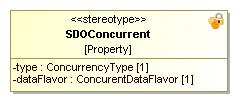

1.  SDOConcurrent

Table 2 - SDOConcurrent Stereotype Detail

|                      |                                                                 |
|----------------------|-----------------------------------------------------------------|
| **Name**             | SDOConcurrent                                                   |
| **Qualified Name**   | Plasma SDO Profile::SDOConcurrent                               |
| **Visibility**       | public                                                          |
| **Abstract**         | false                                                           |
| **Base Stereotypes** |                                                                 |
| **Metaclass**        | UML Standard Profile::UML2 Metamodel::Classes::Kernel::Property |

### **Attribute Detail**

Following are the attributes for stereotype, SDOConcurrent.

Table 3 – SDOConcurrent Attribute Detail

|                |                                                                                                                             |                     |             |            |
|----------------|-----------------------------------------------------------------------------------------------------------------------------|---------------------|-------------|------------|
| Attribute Name | Description                                                                                                                 | Type                | Cardinality | Visibility |
| **dataFlavor** | For a UML property, denotes or provides a hint as to the nature of the data with respect concurrency or concurrency control | ConcurentDataFlavor | 1:1         | private    |
| **type**       | Specifies the general category of concurrency or concurrency control under which a UML property participates                | ConcurrencyType     | 1:1         | private    |

### **Relation Detail**

Following are the relations for class, SDOConcurrent.

Table 5 – SDOConcurrent Relation Detail

|               |                   |
|---------------|-------------------|
| Relation Type | Related Elements  |
| **Extension** | -   Property      
                     
  -   SDOConcurrent  |

**Stereotype** **SDODerivation**
--------------------------------

**Description**

This UML stereotype is applied to a consumer UML named-element that is computed from the supplier element.

> 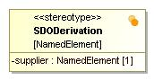

1.  SDODerivation

Table 2 - SDODerivation Stereotype Detail

|                      |                                                                     |
|----------------------|---------------------------------------------------------------------|
| **Name**             | SDODerivation                                                       |
| **Qualified Name**   | Plasma SDO Profile::SDODerivation                                   |
| **Visibility**       | public                                                              |
| **Abstract**         | false                                                               |
| **Base Stereotypes** |                                                                     |
| **Metaclass**        | UML Standard Profile::UML2 Metamodel::Classes::Kernel::NamedElement |

### **Attribute Detail**

Following are the attributes for stereotype, SDODerivation.

Table 3 – SDODerivation Attribute Detail

|                |                                                                                         |              |             |            |
|----------------|-----------------------------------------------------------------------------------------|--------------|-------------|------------|
| Attribute Name | Description                                                                             | Type         | Cardinality | Visibility |
| **supplier**   | The supplier element or set of supplier elements which represent the derivation source. | NamedElement | 1:1         | private    |

### **Relation Detail**

Following are the relations for class, SDODerivation.

Table 5 – SDODerivation Relation Detail

|               |                   |
|---------------|-------------------|
| Relation Type | Related Elements  |
| **Extension** | -   NamedElement  
                     
  -   SDODerivation  |

**Stereotype** **SDODocumentation**
-----------------------------------

**Description**

This stereotype annotates or tags a UML owned comment for any UML element in a model providing hints as to the nature of the comment and how it might be presented.

> 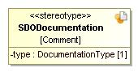

1.  SDODocumentation

Table 2 - SDODocumentation Stereotype Detail

|                      |                                                                |
|----------------------|----------------------------------------------------------------|
| **Name**             | SDODocumentation                                               |
| **Qualified Name**   | Plasma SDO Profile::SDODocumentation                           |
| **Visibility**       | public                                                         |
| **Abstract**         | false                                                          |
| **Base Stereotypes** |                                                                |
| **Metaclass**        | UML Standard Profile::UML2 Metamodel::Classes::Kernel::Comment |

### **Attribute Detail**

Following are the attributes for stereotype, SDODocumentation.

Table 3 – SDODocumentation Attribute Detail

|                |             |                   |             |            |
|----------------|-------------|-------------------|-------------|------------|
| Attribute Name | Description | Type              | Cardinality | Visibility |
| **type**       |             | DocumentationType | 1:1         | private    |

### **Relation Detail**

Following are the relations for class, SDODocumentation.

Table 5 – SDODocumentation Relation Detail

|               |                      |
|---------------|----------------------|
| Relation Type | Related Elements     |
| **Extension** | -   Comment          
                        
  -   SDODocumentation  |

**Stereotype** **SDOEnumeration**
---------------------------------

**Description**

This stereotype tags or annotates a UML enumeration for use within the PlasmaSDO™ implementation

> 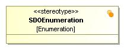

1.  SDOEnumeration

Table 2 - SDOEnumeration Stereotype Detail

|                      |                                                                    |
|----------------------|--------------------------------------------------------------------|
| **Name**             | SDOEnumeration                                                     |
| **Qualified Name**   | Plasma SDO Profile::SDOEnumeration                                 |
| **Visibility**       | public                                                             |
| **Abstract**         | false                                                              |
| **Base Stereotypes** |                                                                    |
| **Metaclass**        | UML Standard Profile::UML2 Metamodel::Classes::Kernel::Enumeration |

### **Attribute Detail**

Following are the attributes for stereotype, SDOEnumeration.

Table 3 – SDOEnumeration Attribute Detail

|                |             |      |             |            |
|----------------|-------------|------|-------------|------------|
| Attribute Name | Description | Type | Cardinality | Visibility |

### **Relation Detail**

Following are the relations for class, SDOEnumeration.

Table 5 – SDOEnumeration Relation Detail

|               |                    |
|---------------|--------------------|
| Relation Type | Related Elements   |
| **Extension** | -   Enumeration    
                      
  -   SDOEnumeration  |

**Stereotype** **SDOEnumerationConstraint**
-------------------------------------------

**Description**

This stereotype constrains a UML property by means of a given UML enumeration. It enables use of UML Enumerations which are &lt;b&gt;part&lt;/b&gt; of the UML model when specifying a constraint on class properties. UML Enumerations used with this stereotype must be tagged with the SDOEnumeration stereotype.

> 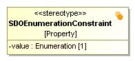

1.  SDOEnumerationConstraint

Table 2 - SDOEnumerationConstraint Stereotype Detail

|                      |                                                                 |
|----------------------|-----------------------------------------------------------------|
| **Name**             | SDOEnumerationConstraint                                        |
| **Qualified Name**   | Plasma SDO Profile::SDOEnumerationConstraint                    |
| **Visibility**       | public                                                          |
| **Abstract**         | false                                                           |
| **Base Stereotypes** |                                                                 |
| **Metaclass**        | UML Standard Profile::UML2 Metamodel::Classes::Kernel::Property |

### **Attribute Detail**

Following are the attributes for stereotype, SDOEnumerationConstraint.

Table 3 – SDOEnumerationConstraint Attribute Detail

|                |                                                                                                                                                                |             |             |            |
|----------------|----------------------------------------------------------------------------------------------------------------------------------------------------------------|-------------|-------------|------------|
| Attribute Name | Description                                                                                                                                                    | Type        | Cardinality | Visibility |
| **value**      | The UML enumeration class with which to restrict a UML property. UML Enumerations used with this stereotype must be tagged with the SDOEnumeration stereotype. | Enumeration | 1:1         | private    |

### **Relation Detail**

Following are the relations for class, SDOEnumerationConstraint.

Table 5 – SDOEnumerationConstraint Relation Detail

|               |                              |
|---------------|------------------------------|
| Relation Type | Related Elements             |
| **Extension** | -   Property                 
                                
  -   SDOEnumerationConstraint  |

**Stereotype** **SDOKey**
-------------------------

**Description**

This stereotype tags or annotates a UML property as representing some type of key within a data store, data transfer or transient storage medium.

> 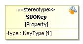

1.  SDOKey

Table 2 - SDOKey Stereotype Detail

|                      |                                                                 |
|----------------------|-----------------------------------------------------------------|
| **Name**             | SDOKey                                                          |
| **Qualified Name**   | Plasma SDO Profile::SDOKey                                      |
| **Visibility**       | public                                                          |
| **Abstract**         | false                                                           |
| **Base Stereotypes** |                                                                 |
| **Metaclass**        | UML Standard Profile::UML2 Metamodel::Classes::Kernel::Property |

### **Attribute Detail**

Following are the attributes for stereotype, SDOKey.

Table 3 – SDOKey Attribute Detail

|                |                           |         |             |            |
|----------------|---------------------------|---------|-------------|------------|
| Attribute Name | Description               | Type    | Cardinality | Visibility |
| **type**       | Specifies the type of key | KeyType | 1:1         | private    |

### **Relation Detail**

Following are the relations for class, SDOKey.

Table 5 – SDOKey Relation Detail

|               |                  |
|---------------|------------------|
| Relation Type | Related Elements |
| **Extension** | -   Property     
                    
  -   SDOKey        |

**Stereotype** **SDONamespace**
-------------------------------

**Description**

This stereotype tags or annotates a UML package as an SDO namespace.

> 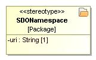

1.  SDONamespace

Table 2 - SDONamespace Stereotype Detail

|                      |                                                                |
|----------------------|----------------------------------------------------------------|
| **Name**             | SDONamespace                                                   |
| **Qualified Name**   | Plasma SDO Profile::SDONamespace                               |
| **Visibility**       | public                                                         |
| **Abstract**         | false                                                          |
| **Base Stereotypes** |                                                                |
| **Metaclass**        | UML Standard Profile::UML2 Metamodel::Classes::Kernel::Package |

### **Attribute Detail**

Following are the attributes for stereotype, SDONamespace.

Table 3 – SDONamespace Attribute Detail

|                |                                                                                                                                                                                                  |        |             |            |
|----------------|--------------------------------------------------------------------------------------------------------------------------------------------------------------------------------------------------|--------|-------------|------------|
| Attribute Name | Description                                                                                                                                                                                      | Type   | Cardinality | Visibility |
| **uri**        | The namespace URI used to reference all SDO Types contained within the UML package, and the namespace URI used link or map this UML package to SDO namespace specific configuration information. | String | 1:1         | private    |

### **Relation Detail**

Following are the relations for class, SDONamespace.

Table 5 – SDONamespace Relation Detail

|               |                  |
|---------------|------------------|
| Relation Type | Related Elements |
| **Extension** | -   Package      
                    
  -   SDONamespace  |

**Stereotype** **SDOSemanticConstraint**
----------------------------------------

**Description**

> 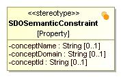

1.  SDOSemanticConstraint

Table 2 - SDOSemanticConstraint Stereotype Detail

|                      |                                                                 |
|----------------------|-----------------------------------------------------------------|
| **Name**             | SDOSemanticConstraint                                           |
| **Qualified Name**   | Plasma SDO Profile::SDOSemanticConstraint                       |
| **Visibility**       | public                                                          |
| **Abstract**         | false                                                           |
| **Base Stereotypes** |                                                                 |
| **Metaclass**        | UML Standard Profile::UML2 Metamodel::Classes::Kernel::Property |

### **Attribute Detail**

Following are the attributes for stereotype, SDOSemanticConstraint.

Table 3 – SDOSemanticConstraint Attribute Detail

|                   |             |        |             |            |
|-------------------|-------------|--------|-------------|------------|
| Attribute Name    | Description | Type   | Cardinality | Visibility |
| **conceptDomain** |             | String | 1:0         | private    |
| **conceptId**     |             | String | 1:0         | private    |
| **conceptName**   |             | String | 1:0         | private    |

### **Relation Detail**

Following are the relations for class, SDOSemanticConstraint.

Table 5 – SDOSemanticConstraint Relation Detail

|               |                           |
|---------------|---------------------------|
| Relation Type | Related Elements          |
| **Extension** | -   Property              
                             
  -   SDOSemanticConstraint  |

**Stereotype** **SDOTemporal**
------------------------------

**Description**

> 

1.  SDOTemporal

Table 2 - SDOTemporal Stereotype Detail

|                      |                                                                 |
|----------------------|-----------------------------------------------------------------|
| **Name**             | SDOTemporal                                                     |
| **Qualified Name**   | Plasma SDO Profile::SDOTemporal                                 |
| **Visibility**       | public                                                          |
| **Abstract**         | false                                                           |
| **Base Stereotypes** |                                                                 |
| **Metaclass**        | UML Standard Profile::UML2 Metamodel::Classes::Kernel::Property |

### **Attribute Detail**

Following are the attributes for stereotype, SDOTemporal.

Table 3 – SDOTemporal Attribute Detail

|                |             |               |             |            |
|----------------|-------------|---------------|-------------|------------|
| Attribute Name | Description | Type          | Cardinality | Visibility |
| **state**      |             | TemporalState | 1:1         | private    |
| **type**       |             | TemporalType  | 1:1         | private    |

### **Relation Detail**

Following are the relations for class, SDOTemporal.

Table 5 – SDOTemporal Relation Detail

|               |                  |
|---------------|------------------|
| Relation Type | Related Elements |
| **Extension** | -   Property     
                    
  -   SDOTemporal   |

**Stereotype** **SDOUniqueConstraint**
--------------------------------------

**Description**

This stereotype tags a UML property as unique within its UML class and resulting SDO Type. if the unique constraint 'name' is valued, the name is used all or in part as the final physical constraint id within a physical data store. Where multiple properties within a class are tagged with this stereotype, if the unique constraint 'name' is valued for more than one UML property, these properties will be used together in the resulting physical constraint.

> 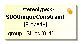

1.  SDOUniqueConstraint

Table 2 - SDOUniqueConstraint Stereotype Detail

|                      |                                                                 |
|----------------------|-----------------------------------------------------------------|
| **Name**             | SDOUniqueConstraint                                             |
| **Qualified Name**   | Plasma SDO Profile::SDOUniqueConstraint                         |
| **Visibility**       | public                                                          |
| **Abstract**         | false                                                           |
| **Base Stereotypes** |                                                                 |
| **Metaclass**        | UML Standard Profile::UML2 Metamodel::Classes::Kernel::Property |

### **Attribute Detail**

Following are the attributes for stereotype, SDOUniqueConstraint.

Table 3 – SDOUniqueConstraint Attribute Detail

|                |                                                                                                  |        |             |            |
|----------------|--------------------------------------------------------------------------------------------------|--------|-------------|------------|
| Attribute Name | Description                                                                                      | Type   | Cardinality | Visibility |
| **group**      | Used to associate one or more UML properties within a class with a single constraint definition. | String | 1:0         | private    |

### **Relation Detail**

Following are the relations for class, SDOUniqueConstraint.

Table 5 – SDOUniqueConstraint Relation Detail

|               |                         |
|---------------|-------------------------|
| Relation Type | Related Elements        |
| **Extension** | -   Property            
                           
  -   SDOUniqueConstraint  |

**Stereotype** **SDOValueConstraint**
-------------------------------------

**Description**

> 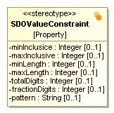

1.  SDOValueConstraint

Table 2 - SDOValueConstraint Stereotype Detail

|                      |                                                                 |
|----------------------|-----------------------------------------------------------------|
| **Name**             | SDOValueConstraint                                              |
| **Qualified Name**   | Plasma SDO Profile::SDOValueConstraint                          |
| **Visibility**       | public                                                          |
| **Abstract**         | false                                                           |
| **Base Stereotypes** |                                                                 |
| **Metaclass**        | UML Standard Profile::UML2 Metamodel::Classes::Kernel::Property |

### **Attribute Detail**

Following are the attributes for stereotype, SDOValueConstraint.

Table 3 – SDOValueConstraint Attribute Detail

|                    |                                                                                                                                         |         |             |            |
|--------------------|-----------------------------------------------------------------------------------------------------------------------------------------|---------|-------------|------------|
| Attribute Name     | Description                                                                                                                             | Type    | Cardinality | Visibility |
| **fractionDigits** | The number of fraction digits for the Property value must be below or equal to the specified total                                      | Integer | 1:0         | private    |
| **maxInclusive**   | Property value must be a number whose value must be lower or equal to the specified maximum                                             | Integer | 1:0         | private    |
| **maxLength**      | Property value must be below or equal to the specified maximum boundary                                                                 | Integer | 1:0         | private    |
| **minInclusice**   | Property value must be a number whose value must be higher or equal to the specificed minimum                                           | Integer | 1:0         | private    |
| **minLength**      | Property value must be above or equal to the specified minimum boundary                                                                 | Integer | 1:0         | private    |
| **pattern**        | The Property value must match the specified regular expression. The regular expression follows the Java regular expression conventions. | String  | 1:0         | private    |
| **totalDigits**    | The total number of digits for the Property value must be below or equal to the specified total                                         | Integer | 1:0         | private    |

### **Relation Detail**

Following are the relations for class, SDOValueConstraint.

Table 5 – SDOValueConstraint Relation Detail

|               |                        |
|---------------|------------------------|
| Relation Type | Related Elements       |
| **Extension** | -   Property           
                          
  -   SDOValueConstraint  |

**Stereotype** **SDOValueSetConstraint**
----------------------------------------

**Description**

This stereotype allows a value set constraint to be specified for a class attribute. Attributes that
have a coded type may be constrained such that the code value in an instance should be taken
from the specified value set. The coding strength determines whether exceptions are allowed.

> 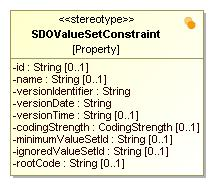

1.  SDOValueSetConstraint

Table 2 - SDOValueSetConstraint Stereotype Detail

|                      |                                                                 |
|----------------------|-----------------------------------------------------------------|
| **Name**             | SDOValueSetConstraint                                           |
| **Qualified Name**   | Plasma SDO Profile::SDOValueSetConstraint                       |
| **Visibility**       | public                                                          |
| **Abstract**         | false                                                           |
| **Base Stereotypes** |                                                                 |
| **Metaclass**        | UML Standard Profile::UML2 Metamodel::Classes::Kernel::Property |

### **Attribute Detail**

Following are the attributes for stereotype, SDOValueSetConstraint.

Table 3 – SDOValueSetConstraint Attribute Detail

<table>
<tbody>
<tr class="odd">
<td>Attribute Name</td>
<td>Description</td>
<td>Type</td>
<td>Cardinality</td>
<td>Visibility</td>
</tr>
<tr class="even">
<td><strong>codingStrength</strong></td>
<td>Indicates whether or not codes are restricted to those expressed in the value set</td>
<td>CodingStrength</td>
<td>1:0</td>
<td>private</td>
</tr>
<tr class="odd">
<td><strong>id</strong></td>
<td>The globally unique identifier for the value set</td>
<td>String</td>
<td>1:0</td>
<td>private</td>
</tr>
<tr class="even">
<td><strong>ignoredValueSetId</strong></td>
<td>Defines the set of codes within the overall value set that the implementer is willing to accept without raising an error, but whose content will be ignored and not processed in any useful manner</td>
<td>String</td>
<td>1:0</td>
<td>private</td>
</tr>
<tr class="odd">
<td><strong>minimumValueSetId</strong></td>
<td>Defines the set of codes within the overall value set that must be supported by an implementer to be considered compliant</td>
<td>String</td>
<td>1:0</td>
<td>private</td>
</tr>
<tr class="even">
<td><strong>name</strong></td>
<td>The descriptive name associated with the value set</td>
<td>String</td>
<td>1:0</td>
<td>private</td>
</tr>
<tr class="odd">
<td><strong>rootCode</strong></td>
<td>Allows conveying the root code of the value set. Only usable for key structural attributes.</td>
<td>String</td>
<td>1:0</td>
<td>private</td>
</tr>
<tr class="even">
<td><strong>versionDate</strong></td>
<td>The date on which a specific version of the value set was created. Used when 
performing static references to a value set</td>
<td>String</td>
<td></td>
<td>private</td>
</tr>
<tr class="odd">
<td><strong>versionIdentifier</strong></td>
<td>The value which identifies a specific version of the value set. Used when 
performing static references to a value set</td>
<td>String</td>
<td></td>
<td>private</td>
</tr>
<tr class="even">
<td><strong>versionTime</strong></td>
<td>The time when a specific version of the value set was created. Used when 
performing static references to a value set</td>
<td>String</td>
<td>1:0</td>
<td>private</td>
</tr>
</tbody>
</table>

### **Relation Detail**

Following are the relations for class, SDOValueSetConstraint.

Table 5 – SDOValueSetConstraint Relation Detail

|               |                           |
|---------------|---------------------------|
| Relation Type | Related Elements          |
| **Extension** | -   Property              
                             
  -   SDOValueSetConstraint  |

 **Enumeration** **CodingStrength**
-----------------------------------

**Description**

Defines whether the specified element is restricted to only using the identified coding system for the element

Table 9 - CodingStrength Detail

|                     |                                    |
|---------------------|------------------------------------|
| **Name**            | CodingStrength                     |
| **Qualified Name**  | Plasma SDO Profile::CodingStrength |
| **Visibility**      | public                             |
| **Base Classifier** |                                    |

### **Literal Detail**

Following are the literals for enumeration, CodingStrength.

Table 10 – CodingStrength Literal Detail

|              |                                                                                                                                                                                                                                          |
|--------------|------------------------------------------------------------------------------------------------------------------------------------------------------------------------------------------------------------------------------------------|
| Literal Name | Description                                                                                                                                                                                                                              |
| **CNE**      | If not null, the element must be coded and must be drawn from the value set specified in the binding                                                                                                                                     |
| **CWE**      | If not null, the element must be coded if there is an appropriate value in the value set specified in the binding. If no appropriate code is available, a local code may be used, or the value may be populated with only original text. |

 **Enumeration** **ConcurentDataFlavor**
----------------------------------------

**Description**

Specifies the nature of the data with respect to concurrency for a UML Property

Table 9 - ConcurentDataFlavor Detail

|                     |                                         |
|---------------------|-----------------------------------------|
| **Name**            | ConcurentDataFlavor                     |
| **Qualified Name**  | Plasma SDO Profile::ConcurentDataFlavor |
| **Visibility**      | public                                  |
| **Base Classifier** |                                         |

### **Literal Detail**

Following are the literals for enumeration, ConcurentDataFlavor.

Table 10 – ConcurentDataFlavor Literal Detail

|              |                                                                                                                                        |
|--------------|----------------------------------------------------------------------------------------------------------------------------------------|
| Literal Name | Description                                                                                                                            |
| **time**     | Indicates the data is temporal in nature typically reset to the system data or time for every successful update of the owning entity.  |
| **user**     | Indicates the data represents a system username, typically reset to the current system user on successful update of the owning entity. |
| **version**  | Indicates the data is an integral version number, typically incremented for every successful update of the owning entity.              |

 **Enumeration** **ConcurrencyType**
------------------------------------

**Description**

Indicates the category of concurrency or concurrency control strategy under which a UML Property participates.

Table 9 - ConcurrencyType Detail

|                     |                                     |
|---------------------|-------------------------------------|
| **Name**            | ConcurrencyType                     |
| **Qualified Name**  | Plasma SDO Profile::ConcurrencyType |
| **Visibility**      | public                              |
| **Base Classifier** |                                     |

### **Literal Detail**

Following are the literals for enumeration, ConcurrencyType.

Table 10 – ConcurrencyType Literal Detail

|                 |                                                                                                                                                                                                                                                                                             |
|-----------------|---------------------------------------------------------------------------------------------------------------------------------------------------------------------------------------------------------------------------------------------------------------------------------------------|
| Literal Name    | Description                                                                                                                                                                                                                                                                                 |
| **optimistic**  | Indicates a UML Property stores information related optimistic concurrency for its containing UML Class and participates in optimistic concurrency control operations and strategies. Informs SDO Data Access Services performing optimistic concurrency control checks and operations.     |
| **origination** | Indicates a UML Property stores origination information for its containing UML Class. Informs Data Access Services (DAS) performing concurrent operations involving origination.                                                                                                            |
| **pessimistic** | Indicates a UML Property stores information related to a pessimistic concurrency control strategy (often termed locking) and participates in pessimistic concurrency control operations. Informs SDO Data Access Services performing pessimistic concurrency control checks and operations. |

 **Enumeration** **DocumentationType**
--------------------------------------

**Description**

> 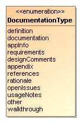

1.  DocumentationType

Table 9 - DocumentationType Detail

|                     |                                       |
|---------------------|---------------------------------------|
| **Name**            | DocumentationType                     |
| **Qualified Name**  | Plasma SDO Profile::DocumentationType |
| **Visibility**      | public                                |
| **Base Classifier** |                                       |

### **Literal Detail**

Following are the literals for enumeration, DocumentationType.

Table 10 – DocumentationType Literal Detail

|                    |             |
|--------------------|-------------|
| Literal Name       | Description |
| **appendix**       |             |
| **appInfo**        |             |
| **definition**     |             |
| **designComments** |             |
| **documentation**  |             |
| **openIssues**     |             |
| **other**          |             |
| **rationale**      |             |
| **references**     |             |
| **requirements**   |             |
| **usageNotes**     |             |
| **walkthrough**    |             |

 **Enumeration** **KeyType**
----------------------------

**Description**

This enumeration specifies the set of key types possible for any UML Property tagged with the SDOKey stereotype.

Table 9 - KeyType Detail

|                     |                             |
|---------------------|-----------------------------|
| **Name**            | KeyType                     |
| **Qualified Name**  | Plasma SDO Profile::KeyType |
| **Visibility**      | public                      |
| **Base Classifier** |                             |

### **Literal Detail**

Following are the literals for enumeration, KeyType.

Table 10 – KeyType Literal Detail

|              |                                                                                                               |
|--------------|---------------------------------------------------------------------------------------------------------------|
| Literal Name | Description                                                                                                   |
| **embedded** | A key used as an internal identifier for the UML Class of the UML Property tagged with the SDOKey stereotype. |
| **primary**  | A key used as a primary identifier for the UML Class of the UML Property tagged with the SDOKey stereotype.   |

 **Enumeration** **TemporalState**
----------------------------------

**Description**

Table 9 - TemporalState Detail

|                     |                                   |
|---------------------|-----------------------------------|
| **Name**            | TemporalState                     |
| **Qualified Name**  | Plasma SDO Profile::TemporalState |
| **Visibility**      | public                            |
| **Base Classifier** |                                   |

### **Literal Detail**

Following are the literals for enumeration, TemporalState.

Table 10 – TemporalState Literal Detail

|              |             |
|--------------|-------------|
| Literal Name | Description |
| **actual**   |             |
| **plan**     |             |
| **proposal** |             |

 **Enumeration** **TemporalType**
---------------------------------

**Description**

Specifies the various notions of time which are relevant for temporal databases

Table 9 - TemporalType Detail

|                     |                                  |
|---------------------|----------------------------------|
| **Name**            | TemporalType                     |
| **Qualified Name**  | Plasma SDO Profile::TemporalType |
| **Visibility**      | public                           |
| **Base Classifier** |                                  |

### **Literal Detail**

Following are the literals for enumeration, TemporalType.

Table 10 – TemporalType Literal Detail

|                 |                                                                                                                    |
|-----------------|--------------------------------------------------------------------------------------------------------------------|
| Literal Name    | Description                                                                                                        |
| **transaction** | Transaction time is the time period during which a fact is stored in the database                                  |
| **validEnd**    | Valid end time denotes the ending of a time period during which a fact is true with respect to the real world      |
| **validStart**  | Valid start time denotes the beginning of a time period during which a fact is true with respect to the real world |

**Package Plasma SDO Profile::datatypes**
=========================================

**Description**

This UML package contains UML data type definitions. The name of each UML data type maps directly to a Service Data Objects (SDO) 2.1 datatype found in the SDO 2.1.0 Specification. The term SDO data type refers to an SDO Type where isDataType() = true and where none of the types have any SDO Properties unless noted. Each UML class (data) attribute within a model intended to be used with PlasmaSDO, must have one of the SDO datatypes set as it's UML type.
The SDO Types are applicable across all languages mapped into SDO. For example the SDO Java Types are additional types specifically used in Java representing the object wrappers for primitive Java types. When an SDO Type is used in a mapping from another technology to SDO, implementations in Java specify one of the corresponding Java types.
Each DataType has a String representation and may be converted to and from the String representation to its instance class, if that instance class is different from String. Numeric DataTypes have a precision in terms of a number of bits. For example, 32 bits signed indicates 1 sign bit and 31 value bits, with a range of -2^31 to 2^31-1. The String representation of DateTime, Duration, Time, Day, Month, MonthDay, Year, YearMonth, and YearMonthDay follows the lexical representation defined in XML Schema for the corresponding data types: dateTime, duration, time, gDay, gMonth, gMonthDay, gYear, gYearMonth, and Date respectively.

Table 1 - Plasma SDO Profile::datatypes Package Detail

|                    |                               |
|--------------------|-------------------------------|
| **Name**           | datatypes                     |
| **Qualified Name** | Plasma SDO Profile::datatypes |

**Datatype** **Boolean**
------------------------

**Description**

This UML data type maps directly to the Service Data Objects (SDO) 2.1 Boolean data type. For language specific mappings for this data type, see the language-specific SDO 2.1.0 Specification.

Table 12 - Boolean Detail

|                    |                                        |
|--------------------|----------------------------------------|
| **Name**           | Boolean                                |
| **Qualified Name** | Plasma SDO Profile::datatypes::Boolean |
| **Visibility**     | public                                 |

**Datatype** **Byte**
---------------------

**Description**

This UML data type maps directly to the Service Data Objects (SDO) 2.1 Byte data type. For language specific mappings for this data type, see the language-specific SDO 2.1.0 Specification.

Table 12 - Byte Detail

|                    |                                     |
|--------------------|-------------------------------------|
| **Name**           | Byte                                |
| **Qualified Name** | Plasma SDO Profile::datatypes::Byte |
| **Visibility**     | public                              |

**Datatype** **Bytes**
----------------------

**Description**

This UML data type maps directly to the Service Data Objects (SDO) 2.1 Bytes data type. For language specific mappings for this data type, see the language-specific SDO 2.1.0 Specification.

Table 12 - Bytes Detail

|                    |                                      |
|--------------------|--------------------------------------|
| **Name**           | Bytes                                |
| **Qualified Name** | Plasma SDO Profile::datatypes::Bytes |
| **Visibility**     | public                               |

**Datatype** **Character**
--------------------------

**Description**

This UML data type maps directly to the Service Data Objects (SDO) 2.1 Character data type. For language specific mappings for this data type, see the language-specific SDO 2.1.0 Specification.

Table 12 - Character Detail

|                    |                                          |
|--------------------|------------------------------------------|
| **Name**           | Character                                |
| **Qualified Name** | Plasma SDO Profile::datatypes::Character |
| **Visibility**     | public                                   |

**Datatype** **Date**
---------------------

**Description**

This UML data type maps directly to the Service Data Objects (SDO) 2.1 Date data type. For language specific mappings for this data type, see the language-specific SDO 2.1.0 Specification.

Table 12 - Date Detail

|                    |                                     |
|--------------------|-------------------------------------|
| **Name**           | Date                                |
| **Qualified Name** | Plasma SDO Profile::datatypes::Date |
| **Visibility**     | public                              |

**Datatype** **DateTime**
-------------------------

**Description**

This UML data type maps directly to the Service Data Objects (SDO) 2.1 DateTime data type. For language specific mappings for this data type, see the language-specific SDO 2.1.0 Specification.

Table 12 - DateTime Detail

|                    |                                         |
|--------------------|-----------------------------------------|
| **Name**           | DateTime                                |
| **Qualified Name** | Plasma SDO Profile::datatypes::DateTime |
| **Visibility**     | public                                  |

**Datatype** **Day**
--------------------

**Description**

This UML data type maps directly to the Service Data Objects (SDO) 2.1 Day data type. For language specific mappings for this data type, see the language-specific SDO 2.1.0 Specification.

Table 12 - Day Detail

|                    |                                    |
|--------------------|------------------------------------|
| **Name**           | Day                                |
| **Qualified Name** | Plasma SDO Profile::datatypes::Day |
| **Visibility**     | public                             |

**Datatype** **Decimal**
------------------------

**Description**

This UML data type maps directly to the Service Data Objects (SDO) 2.1 Decimal data type. For language specific mappings for this data type, see the language-specific SDO 2.1.0 Specification.

Table 12 - Decimal Detail

|                    |                                        |
|--------------------|----------------------------------------|
| **Name**           | Decimal                                |
| **Qualified Name** | Plasma SDO Profile::datatypes::Decimal |
| **Visibility**     | public                                 |

**Datatype** **Double**
-----------------------

**Description**

This UML data type maps directly to the Service Data Objects (SDO) 2.1 Decimal data type. For language specific mappings for this data type, see the language-specific SDO 2.1.0 Specification.

Table 12 - Double Detail

|                    |                                       |
|--------------------|---------------------------------------|
| **Name**           | Double                                |
| **Qualified Name** | Plasma SDO Profile::datatypes::Double |
| **Visibility**     | public                                |

**Datatype** **Duration**
-------------------------

**Description**

This UML data type maps directly to the Service Data Objects (SDO) 2.1 Duration data type. For language specific mappings for this data type, see the language-specific SDO 2.1.0 Specification.

Table 12 - Duration Detail

|                    |                                         |
|--------------------|-----------------------------------------|
| **Name**           | Duration                                |
| **Qualified Name** | Plasma SDO Profile::datatypes::Duration |
| **Visibility**     | public                                  |

**Datatype** **Float**
----------------------

**Description**

This UML data type maps directly to the Service Data Objects (SDO) 2.1 Float data type. For language specific mappings for this data type, see the language-specific SDO 2.1.0 Specification.

Table 12 - Float Detail

|                    |                                      |
|--------------------|--------------------------------------|
| **Name**           | Float                                |
| **Qualified Name** | Plasma SDO Profile::datatypes::Float |
| **Visibility**     | public                               |

**Datatype** **Int**
--------------------

**Description**

This UML data type maps directly to the Service Data Objects (SDO) 2.1 Int data type. For language specific mappings for this data type, see the language-specific SDO 2.1.0 Specification.

Table 12 - Int Detail

|                    |                                    |
|--------------------|------------------------------------|
| **Name**           | Int                                |
| **Qualified Name** | Plasma SDO Profile::datatypes::Int |
| **Visibility**     | public                             |

**Datatype** **Integer**
------------------------

**Description**

This UML data type maps directly to the Service Data Objects (SDO) 2.1 Integer data type. For language specific mappings for this data type, see the language-specific SDO 2.1.0 Specification.

Table 12 - Integer Detail

|                    |                                        |
|--------------------|----------------------------------------|
| **Name**           | Integer                                |
| **Qualified Name** | Plasma SDO Profile::datatypes::Integer |
| **Visibility**     | public                                 |

**Datatype** **Long**
---------------------

**Description**

This UML data type maps directly to the Service Data Objects (SDO) 2.1 Long data type. For language specific mappings for this data type, see the language-specific SDO 2.1.0 Specification.

Table 12 - Long Detail

|                    |                                     |
|--------------------|-------------------------------------|
| **Name**           | Long                                |
| **Qualified Name** | Plasma SDO Profile::datatypes::Long |
| **Visibility**     | public                              |

**Datatype** **Month**
----------------------

**Description**

This UML data type maps directly to the Service Data Objects (SDO) 2.1 Month data type. For language specific mappings for this data type, see the language-specific SDO 2.1.0 Specification.

Table 12 - Month Detail

|                    |                                      |
|--------------------|--------------------------------------|
| **Name**           | Month                                |
| **Qualified Name** | Plasma SDO Profile::datatypes::Month |
| **Visibility**     | public                               |

**Datatype** **MonthDay**
-------------------------

**Description**

This UML data type maps directly to the Service Data Objects (SDO) 2.1 MonthDay data type. For language specific mappings for this data type, see the language-specific SDO 2.1.0 Specification.

Table 12 - MonthDay Detail

|                    |                                         |
|--------------------|-----------------------------------------|
| **Name**           | MonthDay                                |
| **Qualified Name** | Plasma SDO Profile::datatypes::MonthDay |
| **Visibility**     | public                                  |

**Datatype** **Object**
-----------------------

**Description**

This UML data type maps directly to the Service Data Objects (SDO) 2.1 Object data type. For language specific mappings for this data type, see the language-specific SDO 2.1.0 Specification.

Table 12 - Object Detail

|                    |                                       |
|--------------------|---------------------------------------|
| **Name**           | Object                                |
| **Qualified Name** | Plasma SDO Profile::datatypes::Object |
| **Visibility**     | public                                |

**Datatype** **Short**
----------------------

**Description**

This UML data type maps directly to the Service Data Objects (SDO) 2.1 Short data type. For language specific mappings for this data type, see the language-specific SDO 2.1.0 Specification.

Table 12 - Short Detail

|                    |                                      |
|--------------------|--------------------------------------|
| **Name**           | Short                                |
| **Qualified Name** | Plasma SDO Profile::datatypes::Short |
| **Visibility**     | public                               |

**Datatype** **String**
-----------------------

**Description**

This UML data type maps directly to the Service Data Objects (SDO) 2.1 String data type. For language specific mappings for this data type, see the language-specific SDO 2.1.0 Specification.

Table 12 - String Detail

|                    |                                       |
|--------------------|---------------------------------------|
| **Name**           | String                                |
| **Qualified Name** | Plasma SDO Profile::datatypes::String |
| **Visibility**     | public                                |

**Datatype** **Strings**
------------------------

**Description**

This UML data type maps directly to the Service Data Objects (SDO) 2.1 Strings data type. For language specific mappings for this data type, see the language-specific SDO 2.1.0 Specification.

Table 12 - Strings Detail

|                    |                                        |
|--------------------|----------------------------------------|
| **Name**           | Strings                                |
| **Qualified Name** | Plasma SDO Profile::datatypes::Strings |
| **Visibility**     | public                                 |

**Datatype** **Time**
---------------------

**Description**

This UML data type maps directly to the Service Data Objects (SDO) 2.1 Time data type. For language specific mappings for this data type, see the language-specific SDO 2.1.0 Specification.

Table 12 - Time Detail

|                    |                                     |
|--------------------|-------------------------------------|
| **Name**           | Time                                |
| **Qualified Name** | Plasma SDO Profile::datatypes::Time |
| **Visibility**     | public                              |

**Datatype** **URI**
--------------------

**Description**

This UML data type maps directly to the Service Data Objects (SDO) 2.1 URI data type. For language specific mappings for this data type, see the language-specific SDO 2.1.0 Specification.

Table 12 - URI Detail

|                    |                                    |
|--------------------|------------------------------------|
| **Name**           | URI                                |
| **Qualified Name** | Plasma SDO Profile::datatypes::URI |
| **Visibility**     | public                             |

**Datatype** **Year**
---------------------

**Description**

This UML data type maps directly to the Service Data Objects (SDO) 2.1 Year data type. For language specific mappings for this data type, see the language-specific SDO 2.1.0 Specification.

Table 12 - Year Detail

|                    |                                     |
|--------------------|-------------------------------------|
| **Name**           | Year                                |
| **Qualified Name** | Plasma SDO Profile::datatypes::Year |
| **Visibility**     | public                              |

**Datatype** **YearMonth**
--------------------------

**Description**

This UML data type maps directly to the Service Data Objects (SDO) 2.1 YearMonth data type. For language specific mappings for this data type, see the language-specific SDO 2.1.0 Specification.

Table 12 - YearMonth Detail

|                    |                                          |
|--------------------|------------------------------------------|
| **Name**           | YearMonth                                |
| **Qualified Name** | Plasma SDO Profile::datatypes::YearMonth |
| **Visibility**     | public                                   |

**Datatype** **YearMonthDay**
-----------------------------

**Description**

This UML data type maps directly to the Service Data Objects (SDO) 2.1 YearMonthDay data type. For language specific mappings for this data type, see the language-specific SDO 2.1.0 Specification.

Table 12 - YearMonthDay Detail

|                    |                                             |
|--------------------|---------------------------------------------|
| **Name**           | YearMonthDay                                |
| **Qualified Name** | Plasma SDO Profile::datatypes::YearMonthDay |
| **Visibility**     | public                                      |

**Appendix A. Diagram**
=======================

**UML Comment Extension Stereotypes**
-------------------------------------

**Description**

> 

1.  UML Comment Extension Stereotypes

**UML Enumeration Extension Stereotypes**
-----------------------------------------

**Description**

> 

1.  UML Enumeration Extension Stereotypes

**UML NamedElement Extension Stereotypes**
------------------------------------------

**Description**

> 

1.  UML NamedElement Extension Stereotypes

**UML Package Extension Stereotypes**
-------------------------------------

**Description**

> 

1.  UML Package Extension Stereotypes

**UML Property Extension Stereotypes**
--------------------------------------

**Description**

> 

1.  UML Property Extension Stereotypes

